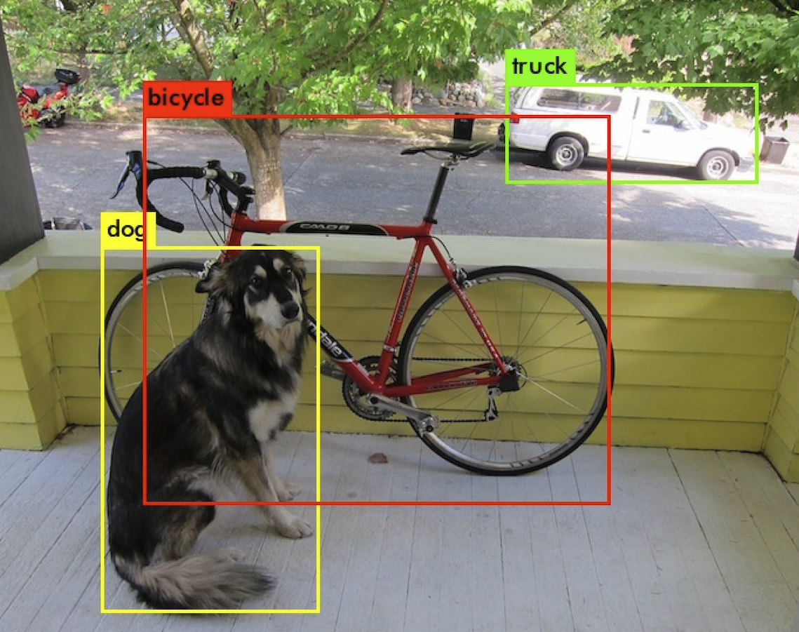

# Realtime-Object-Detection

This is a very small Python raltime object detection implementation tested on macOS (12 Monterey) using the build in webcam and OpenCV. NOTE: Please load the pretrained Deep Learning weights file from here --> https://pjreddie.com/darknet/yolo/ (yolov3.weights 237MB) and place it in the model folder. The file is to large (exceeds 100MB) for github and must be loaed by hand.

Start with: `python RealTimeObjectDetection.py`
